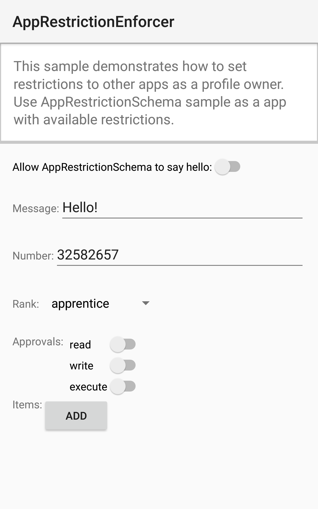

Android AppRestrictionEnforcer Sample
===================================

This sample demonstrates how to set restrictions to other apps as a profile owner.
            Use the AppRestrictionSchema sample to set restrictions.

Introduction
------------

The [Android Device Administration API][1] allows enterprise administrators to
enforce specific policies on a managed device. The system provides policies
that control settings such as password complexity, screen lock, or camera
availability. Developers can also augment this list with custom policies
that control specific features within their applications. For example,
a web browser could provide access to a list of allowed domains.

This sample demonstrates the 'admin' component and shows how a number of
custom properties (booleans, strings, numbers, lists) can be set and
enforced on another app.

See the [AppRestrictionSchema sample][2] for further details.

[1]: http://developer.android.com/guide/topics/admin/device-admin.html
[2]: https://github.com/googlesamples/android-AppRestrictionSchema

Pre-requisites
--------------

- Android SDK 33
- Android Studio Dolphin | 2021.3.1 Patch 1

Screenshots
-------------

 

Getting Started
---------------

This sample uses the Gradle build system. To build this project, use the
"gradlew build" command or use "Import Project" in Android Studio.

Support
-------

- Stack Overflow: http://stackoverflow.com/questions/tagged/android

If you've found an error in this sample, please file an issue:
https://github.com/android/enterprise

Patches are encouraged, and may be submitted by forking this project and
submitting a pull request through GitHub. Please see CONTRIBUTING.md for more details.
