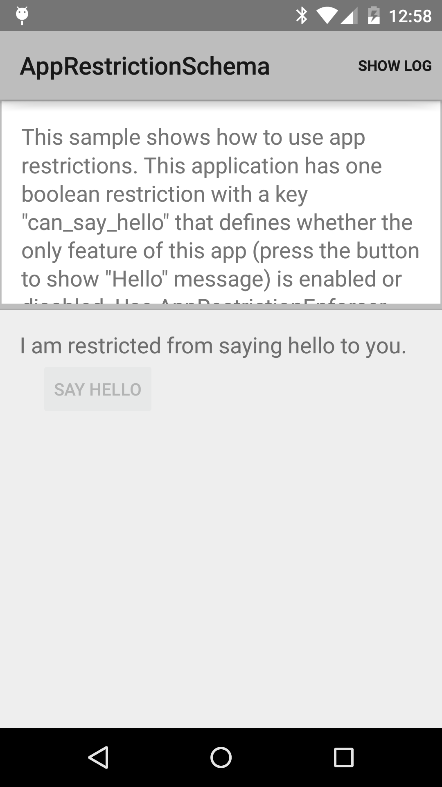

Android AppRestrictionSchema Sample
===================================

A basic app showing how to allow a device administrator to restrict user
activities using the Android Device Administration API. The app exports
a custom policy that enables or disables a UI control. Device Administration
applications are able to enforce a specific value for this policy, as
directed by enterprise administrators.

Introduction
------------

The [Android Device Administration API][1] allows enterprise administrators to
enforce specific policies on a managed device. The system provides policies
that control settings such as password complexity, screen lock, or camera
availability. Developers can also augment this list with custom policies
that control specific features within their applications. For example,
a web browser could provide access to a whitelist of allowed domains.

The list of policies exposed by an app must be specified using a file
inside of the `res/xml` directory, using the `<restriction>` tag:

```xml
<restrictions xmlns:android="http://schemas.android.com/apk/res/android">

    <restriction
            android:defaultValue="false"
            android:description="@string/description_can_say_hello"
            android:key="can_say_hello"
            android:restrictionType="bool"
            android:title="@string/title_can_say_hello" />

</restrictions>
```

In this sample, that file can be found at
`Application/src/main/res/xml/app_restrictions.xml`. This file must be
also be declared inside of `ApplicationManifest.xml` using a `<meta-data>`
element:

```xml
<meta-data
        android:name="android.content.APP_RESTRICTIONS"
        android:resource="@xml/app_restrictions" />
```

At runtime, the current list of restrictions enforced by policy can be
checked by calling [RestrictionsManager.getApplicationRestrictions()][2].

[1]: http://developer.android.com/guide/topics/admin/device-admin.html
[2]: https://developer.android.com/reference/android/content/RestrictionsManager.html#getApplicationRestrictions()

Pre-requisites
--------------

- Android SDK 28
- Android Build Tools v28.0.3
- Android Support Repository

Screenshots
-------------

 

Getting Started
---------------

This sample uses the Gradle build system. To build this project, use the
"gradlew build" command or use "Import Project" in Android Studio.

Support
-------

- Stack Overflow: http://stackoverflow.com/questions/tagged/android

If you've found an error in this sample, please file an issue:
https://github.com/android/enterprise

Patches are encouraged, and may be submitted by forking this project and
submitting a pull request through GitHub. Please see CONTRIBUTING.md for more details.
