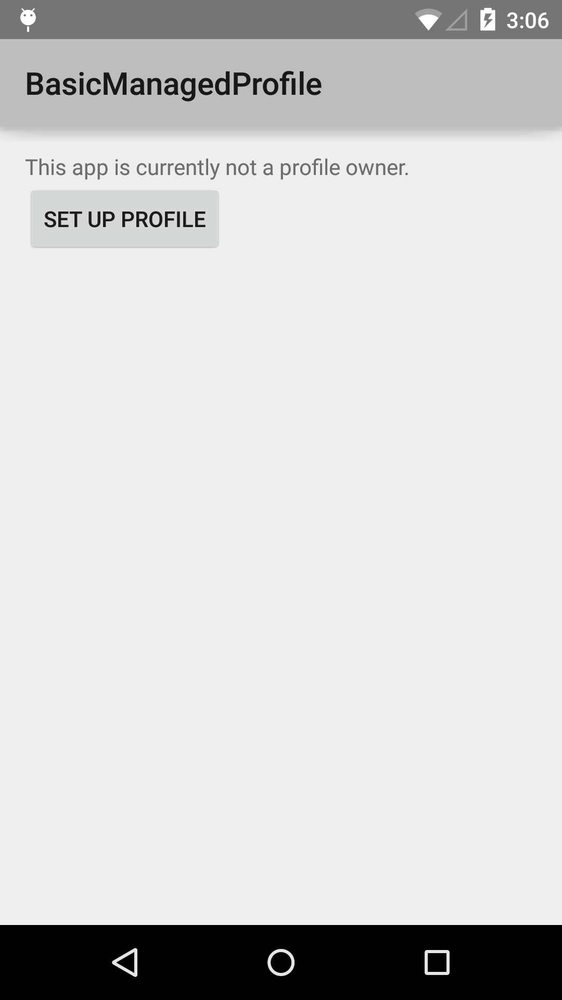
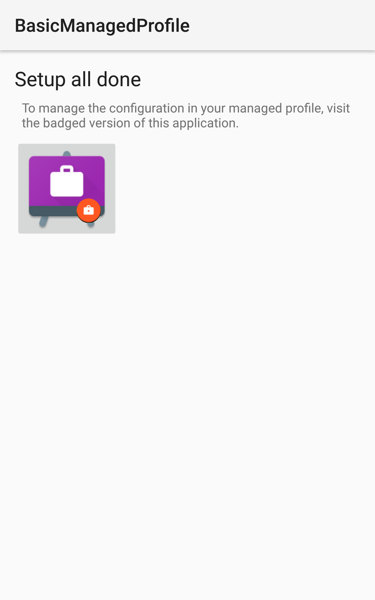
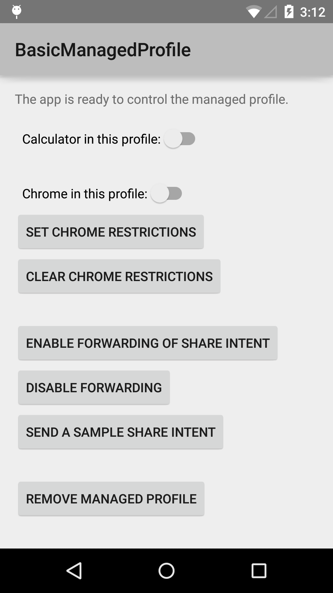

Android BasicManagedProfile Sample
===================================

This sample demonstrates basic functionalities of Managed Profile API
introduced in Android 5.0 Lollipop. You can set up this app as a
profile owner, and use this app to enable/disable apps in the newly
created managed profile. You can also set restrictions to some apps,
enable/disable Intent forwarding between profiles, and wipe out all
the data associated with the profile.

Introduction
------------

As of Android 5.0, DevicePolicyManager introduces new features to
support managed profile.

To set up this app as a profile owner, you need to encrypt your device
(you are prompted to do if you haven't). This doesn't wipe out the
device, but be aware that you can set up only one managed profile at a
time.

[isProfileOwnerApp][1] can be used to determine if a particular
package is registered as the profile owner for the current user. You
can initiate the provisioning flow of a managed profile with Intent of
[ACTION_PROVISION_MANAGED_PROFILE][2].

In order to receive the result of provisioning flow, you have to create an
Activity that reacts to [android.app.action.PROVISIONING_SUCCESSFUL][3] Intent
action. Use [setProfileEnabled][4] to enable the newly created
profile. Implement a class extending [DeviceAdminReceiver][5] and specify it as
the parameter. Your app is now set up as a profile owner. To support API levels
below 26, you also have to enable the profile in
[onProfileProvisioningComplete][6].

[1]: http://developer.android.com/reference/android/app/admin/DevicePolicyManager.html#isProfileOwnerApp(java.lang.String)
[2]: http://developer.android.com/reference/android/app/admin/DevicePolicyManager.html#ACTION_PROVISION_MANAGED_PROFILE
[3]: https://developer.android.com/reference/android/app/admin/DevicePolicyManager#ACTION_PROVISIONING_SUCCESSFUL
[4]: http://developer.android.com/reference/android/app/admin/DevicePolicyManager.html#setProfileEnabled(android.content.ComponentName)
[5]: http://developer.android.com/reference/android/app/admin/DeviceAdminReceiver.html
[6]: https://developer.android.com/reference/android/app/admin/DeviceAdminReceiver#onProfileProvisioningComplete(android.content.Context,%20android.content.Intent)

Pre-requisites
--------------

- Android SDK 29

Screenshots
-------------

   

Getting Started
---------------

This sample uses the Gradle build system. To build this project, use the
"gradlew build" command or use "Import Project" in Android Studio.

Support
-------

- Stack Overflow: http://stackoverflow.com/questions/tagged/android

If you've found an error in this sample, please file an issue:
https://github.com/android/enterprise

Patches are encouraged, and may be submitted by forking this project and
submitting a pull request through GitHub. Please see CONTRIBUTING.md for more details.
