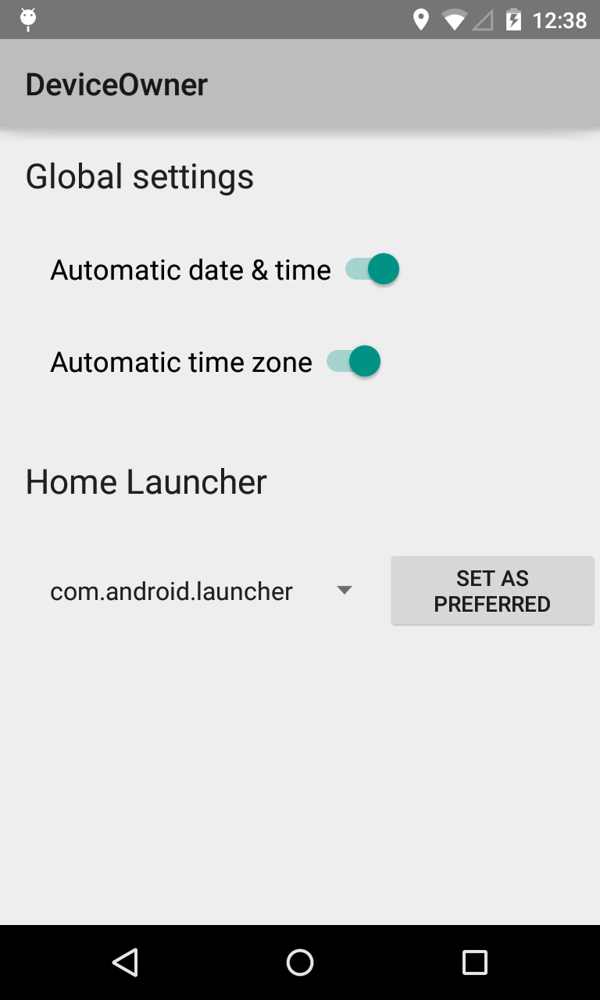

Android DeviceOwner Sample
===================================

This sample demonstrates how to use some device owner features. As a device owner, you can configure
global settings such as automatic time and timezone. You can mandate a specific launcher by
preferred intent handler.

Introduction
------------

In order to set global settings, use [DevicePolicyManager#setGlobalSetting][1] and specify one of
the [Settings.Global][2] keys available. Note that you need to specify its value as a String. As
most of the keys accept boolean values, you will mostly use "1" for true and "0" for false.

You can mandate a specific launcher by adding a persistent preferred activity for an IntentFilter
with Intent.CATEGORY_HOME category. Call [DevicePolicyManager#addPersistentPreferredActivity][3] to
register the activity. You can clear the registration with
[clearPackagePersistentPreferredActivities][4].

As a device owner, you can also use the features available for managed profile owner. See
[BasicManagedProfile][5].

[1]: http://developer.android.com/reference/android/app/admin/DevicePolicyManager.html#setGlobalSetting(android.content.ComponentName, java.lang.String, java.lang.String)
[2]: http://developer.android.com/reference/android/provider/Settings.Global.html
[3]: http://developer.android.com/reference/android/app/admin/DevicePolicyManager.html#addPersistentPreferredActivity(android.content.ComponentName, android.content.IntentFilter, android.content.ComponentName)
[4]: http://developer.android.com/reference/android/app/admin/DevicePolicyManager.html#clearPackagePersistentPreferredActivities(android.content.ComponentName, java.lang.String)
[5]: https://developer.android.com/samples/BasicManagedProfile/index.html

Pre-requisites
--------------

- Android SDK 28
- Android Build Tools v28.0.3
- Android Support Repository

Screenshots
-------------

 

Getting Started
---------------

This sample uses the Gradle build system. To build this project, use the
"gradlew build" command or use "Import Project" in Android Studio.

Support
-------

- Google+ Community: https://plus.google.com/communities/105153134372062985968
- Stack Overflow: http://stackoverflow.com/questions/tagged/android

If you've found an error in this sample, please file an issue:
https://github.com/android/enterprise

Patches are encouraged, and may be submitted by forking this project and
submitting a pull request through GitHub. Please see CONTRIBUTING.md for more details.
